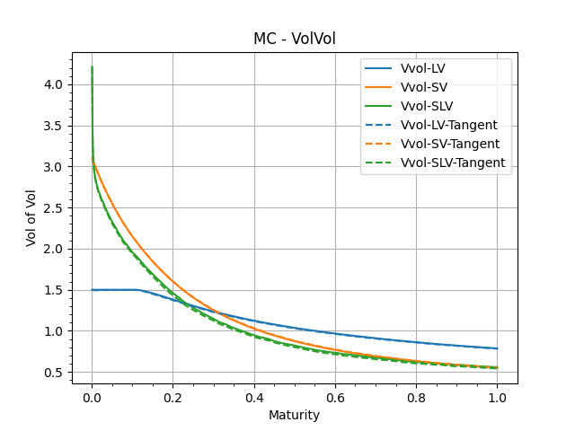
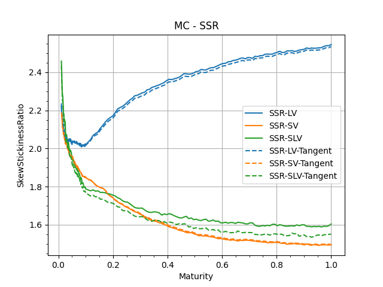
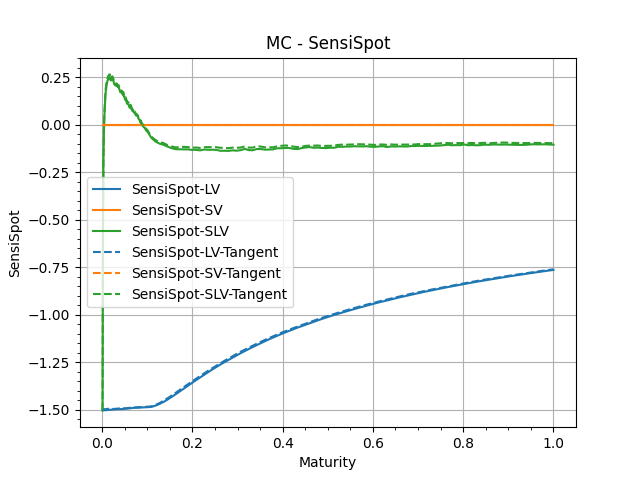
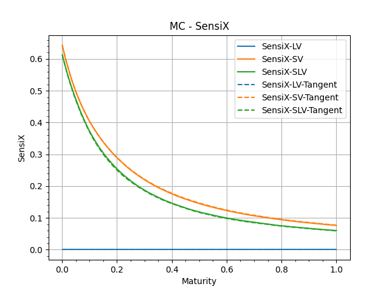
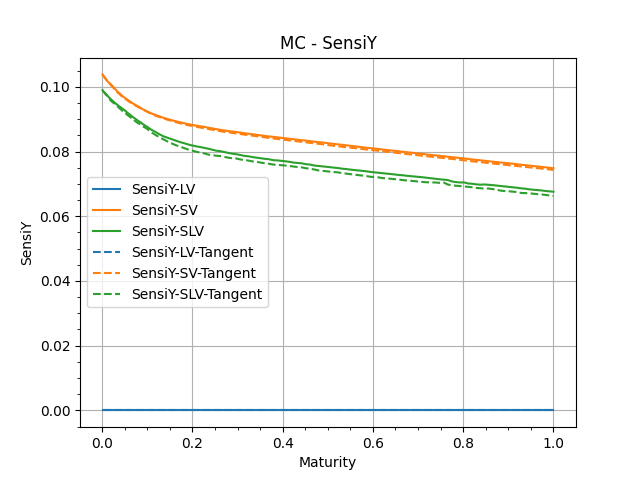
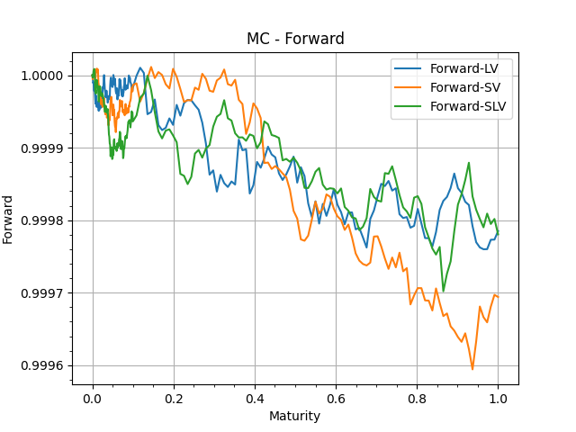
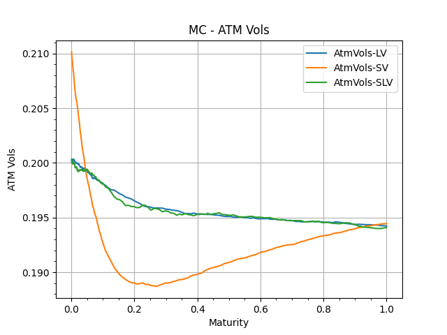
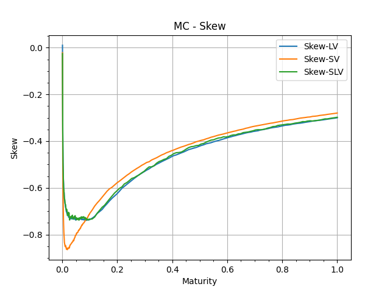

Computing Skew-Stickiness-Ratio for several models.

SSR is usually computed using bumped prices in Monte-Carlo.

We are describing a method involving Malliavin Calculus, using tangent processes, 
to replace the bumps usually used in Monte-Carlo methods.

This method is still a Monte-Carlo method.

# Models

## Local Volatility

One brownian process drives the evolution of the spot.

Usually fitted on market data, we are going to use a linear function, with time-dependent skew.

Similar to $(2.51)$, our local volatility function is defined as:

$$\sigma(t,s)= \min(\sigma_{\max}, \max(\sigma_{\min}, \sigma_0+\alpha(t)x))$$

$$\alpha(t)= 
\begin{cases}
\alpha_0 & \mathrm{if} \  t \leq \tau_0\\
\alpha_0 \left( \frac{\tau_0}{t} \right)^\gamma& \mathrm{if} \  t > \tau_0
\end{cases}
$$

with $\gamma \sim \frac12$

## Stochastic Volatility Model

Let's use two-factor Bergomi model. This uses 3 correlated brownian processes.

Parameters from $Table (12.1)$:

$$\nu = 310\%$$

$$\theta = 0.139$$

$$k_X = 8.59$$

$$k_Y = 0.47$$

$$\rho_{XY} = 0\%$$

$$\rho_{SX} = -54.0\%$$

$$\rho_{SY} = -62.3\%$$

### Equations
2 Factors

$$dX_t = -k_X X_t dt + dW_t^X, X_0=0$$

$$dY_t = -k_Y Y_t dt + dW_t^Y, Y_0=0$$

Volatility deformation

$$x_t^T = \alpha_{\theta}\left[
    (1-\theta) \exp\{-k_X (T-t)\} X_t
    + \theta \exp\{-k_Y (T-t)\} Y_t
\right]$$

$$
\alpha_\theta = \frac{1}{\sqrt{(1-\theta)^2 + \theta^2 + 2 \rho_{XY} \theta (1-\theta)}}
$$

$$\chi(t,T) = \alpha_\theta^2 \left[
    \begin{aligned}
    &(1-\theta)^2 \exp\{-2k_X (T-t)\} \frac{1- \exp\{-2k_X t\}}{2k_X} \\
    +&\theta^2 \exp\{-2k_Y (T-t)\}  \frac{1- \exp\{-2k_Y t\}}{2k_Y} \\
    +&2(1-\theta)\theta \rho_{XY} \exp\{-(k_X + k_Y) (T-t)\}  \frac{1- \exp\{-(k_X + k_Y) t\}}{k_X + k_Y}
    \end{aligned}
\right]$$

Instantaneous variance

$$\xi_t^T = \xi_0^T f^T(t, x_t^T)$$

$$f^T(t,x)=\exp\left(
    \omega x - \frac{\omega^2}{2}\chi(t,T)
\right)$$

$$\omega=2\nu$$

Spot diffusion

$$dS_t=S_t\sqrt{\xi_t^t} \  dW_t^S$$

Correlations - Brownian increments

$$\mathbb{E}\left[
    \delta X \delta Y
\right]
= \rho_{XY}
\frac{1 - \exp \{ -(k_X + k_Y) \delta \tau \}}{k_X +k_Y}
$$

$$\mathbb{E}\left[
    \delta W^S \delta X
\right]
= \rho_{SX}
\frac{1 - \exp \{ -k_X \delta \tau \}}{k_X}
$$

## Stochastic Local Volatility Model

Starting from a Local Volatility Model, and a Stochastic Volatility Model,
we produce a Stochastic Local Volatility Model - using particle method calibration.

# Relevant Quantities

## Skew

$$\mathcal{S}_T = \frac{\mathrm{d} \hat{\sigma}_{KT}}{\mathrm{d} \ln K}_{|F_T}$$

For every model, we price ATMF Option, imply $\hat{\sigma}_{KT}$, for 2 points close to $F_T$, to compute the derivative.

### Local Volatility

$$\mathcal{S}_T = \frac{1}{T} \int_0^T \frac{t}{T} \alpha(t) \mathrm{d} t$$

### Stochastic Volatility

$$\mathcal{S}_T = 
\nu \alpha_\theta \left[
    (1-\theta) \rho_{SX} \frac{k_X T - (1-\exp \{-k_X T\})}{(k_X T)^2}
    + \theta \rho_{SY} \frac{k_Y T - (1-\exp \{-k_Y T\})}{(k_Y T)^2}
\right]
$$

### Stochastic Local Volatility

Model smile is fitted to local volatility.

## Skew-Stickiness-Ratio (SSR)

$$\mathcal{R}_T = 
\frac{1}{\mathcal{S}_T}
\frac{\mathbb{E}\left[ \mathrm{d} \ln S \ \mathrm{d} \hat{\sigma}_{F_T(S)\ T}\right]}{\mathbb{E}\left[ (\mathrm{d} \ln S)^2 \right]}
$$

This will be eveluated numerically using MonteCarlo methods described in the next section.

### Local volatility

$(2.48)$

$$\mathcal{R}_T = 
1 + 
\frac{1}{T}
\int_0^T
\frac{\mathcal{S}_t}{\mathcal{S}_T}
\mathrm{d} t
$$

### Stochastic Volatility

$(12.55)$

$$\mathcal{R}_T = \frac{
    (1-\theta) \rho_{SX} \frac{1 - \exp \{-k_X T\}}{k_X T}
    + \theta \rho_{SY} \frac{1 - \exp \{-k_Y T\}}{k_Y T}
}{
    (1-\theta) \rho_{SX} \frac{k_X T - (1 - \exp \{-k_X T\})}{(k_X T)^2}
    + \theta \rho_{SY} \frac{k_Y T - (1 - \exp \{-k_Y T\})}{(k_Y T)^2}
}
$$

### Stochastic Local Volatility

Perturbation formula $(12.51)$, not quite useful.

Rather use $(12.52)$ - not writing it down, not implemented.

## ATMF Volatility of Volatility

Reuse the derivatives for SSR.

$(12.56)$

$$
\mathrm{d}\hat{\sigma}_{F_T(S) \ T}=
\frac{\mathrm{d}\hat{\sigma}_{F_T(S) \ T}}{\mathrm{d} \ln S} \mathrm{d}\ln S +
\frac{\mathrm{d}\hat{\sigma}_{F_T(S) \ T}}{\mathrm{d} X} \mathrm{d}X +
\frac{\mathrm{d}\hat{\sigma}_{F_T(S) \ T}}{\mathrm{d} Y} \mathrm{d}Y
$$

$$\mathbb{E}\left[d \ln S^2\right] = \sigma_0^2 dt$$

$$\mathbb{E}\left[    d \ln S dX\right]= \sigma_0 \rho_{SX} dt$$

$$\mathbb{E}\left[    d \ln S dY\right]= \sigma_0 \rho_{SY} dt$$

$$\mathbb{E}\left[    dX dY\right]= \rho_{XY} dt$$

$$\mathbb{E}\left[    dX^2\right]= dt$$

$$\mathbb{E}\left[    dY^2\right]= dt$$

$$
vol\left(\hat{\sigma}_{F_T(S)\ T}\right)  = 
\sqrt{
\frac{\langle d \hat{\sigma}_{F_T(S)\ T} , d \hat{\sigma}_{F_T(S)\ T} \rangle}{\hat{\sigma}_{F_T(S)\ T}^2 dt}
}
$$

# MonteCarlo Methods

## Bumps

$$\mathcal{R}_T = 
\frac{1}{\mathcal{S}_T}
\frac{1}{\sigma_0}
\left(\frac{
    \hat{\sigma}_{F_T(S)\ T}(\ln S_0 + \epsilon \sigma_0, X_0 + \epsilon \rho_{SX}, Y_0 + \epsilon \rho_{SY}) 
    - \hat{\sigma}_{F_T(S)\ T} (\ln S_0, X_0,Y_0)
    }{\epsilon}\right)
$$

can be seen as 3 separate bumps.

### Local volatility

Just one bump.

### Stochastic Volatility

Model is homogenous, spot bumps has no effect.

### Stochastic Local Volatility

We use the full formula.

## Tangent process - Malliavin Calculus

no bump, but still MonteCarlo.

### Correlation Matrix

Malliavin Calculus requires uncorrelated Brownians.

However, we realized that we don't need to manipulate the uncorrelated brownian processes - the tangent processes simulations only use $W^S$.

### Functional Derivative

$$
\begin{cases}
dD_s^S S_t
= & 
a_t
(l(t, S_t) + S_T \partial_S l(t,S_t))
D^S_s S_t dW_t^S 
\\
D_s^SS_s = & S_s a_s l(s,S_s)
\end{cases}
$$

$$
\begin{cases}
    \begin{aligned}
dD_s^XS_t
= & 
a_t
(l(t, S_t) + S_T \partial_S l(t,S_t))
D^X_s S_t dW_t^S \\
& +
\frac{\omega}{2}\alpha_{\theta}
\left(
    (1-\theta) \exp \{-k_X (t-s)\}
\right)
dS_t
\end{aligned}
\\
D_s^XS_s = 0
\end{cases}
$$

$$
\begin{cases}
    \begin{aligned}
dD_s^Y S_t
= & 
a_t
(l(t, S_t) + S_T \partial_S l(t,S_t))
D^Y_s S_t dW_t^S \\
& +
\frac{\omega}{2}\alpha_{\theta}
\left(
    \theta \exp \{-k_Y (t-s)\}
\right)
dS_t
\end{aligned}
\\
D_s^Y S_s = 0
\end{cases}
$$

### Functional

$$\phi = ATM \  Option $$

$$
\mathbb{E}\left[
D_s^S \phi
\right] =
\mathbb{E}\left[
\mathbb{1}_{\{S_t > S_0\}}
\mathbb{1}_{\{s \in [0,t]\}}
\left(\frac{D_s^S S_t}{a_0 l(0,S_0)} - S_t \right)
\right]
$$

$$
\mathbb{E}\left[
D_s^X \phi
\right] =
\mathbb{E}\left[
\mathbb{1}_{\{S_t > S_0\}}
\mathbb{1}_{\{s \in [0,t]\}}
D_s^X S_t
\right]
$$

$$
\mathbb{E}\left[
D_s^Y \phi
\right] =
\mathbb{E}\left[
\mathbb{1}_{\{S_t > S_0\}}
\mathbb{1}_{\{s \in [0,t]\}}
D_s^Y S_t
\right]
$$

### Sensitivities

$$\partial_S \hat{\sigma} = \frac{\mathbb{E}\left[D_s^S\phi\right]}{Vega(\hat{\sigma})}$$

$$\partial_X \hat{\sigma} = \frac{\mathbb{E}\left[D_s^X\phi\right]}{Vega(\hat{\sigma})}$$

$$\partial_Y \hat{\sigma} = \frac{\mathbb{E}\left[D_s^Y\phi\right]}{Vega(\hat{\sigma})}$$

We use these sensitivities to evaluate the ATM Volatility of Volatility and the Skew-Stickiness-Ratio.

# Results

## Code performance

Running on my laptop (bought in 2019), with 16Go of RAM, Intel i708550U.

It takes about a minutes to run the script to build all the graphs below, with $n_{MC}=10^5$.

$n_{MC}=10^6$ works too and takes a bit longer, but results are better, this is the parameter used to generate the graphs of the current document.

## Vol of Vol and SSR

Our implementation produces these quantities. Code is readable and runs fast.

Implementing the Tangent Processes is a bit of work, main benefit is to save a bumped price and have the sensitivity directly. The cost of implementing the Tangent Processes increases the number of state variables for the simulated paths, but does not require additional brownian simulation.

Another benefit of Tangent Process is that results are sometimes smoother, but this is not guaranteed - it does make sense intuitively, and is observed empirically.

## Sensitivities

These are the addiitonal quantities that are building blocks of the SSR and Vol of Vol.

In each graph, we show 'Bump-Recompute' version and the 'TangentProcess' version.

## Other Quantities

These are sanity checks to confirm the numerical performances of our MonteCarlo simulations.

One important result we can observe is how close the SLV smile is to the LV smile, showing the success of the calibration method.

# Reference

- Lorenzo Bergomi, *Stochastic Volatility Modeling*, Chapman & Hall, *ISBN 9781482244069*

- Pierre Henry-Labordère, *Analysis, Geometry, and Modeling in Finance - Advanced Methods in Option Pricing*, Chapman & Hall, *ISBN 9781420086997*, Chapter 11
